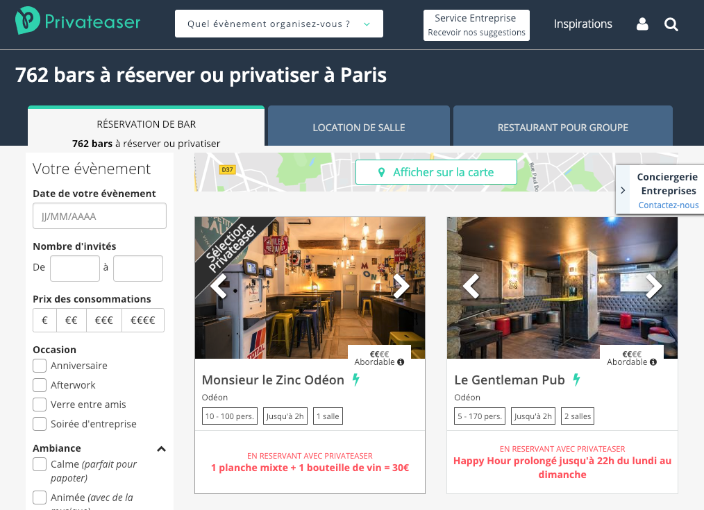
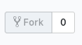

# PRIVATEASER

> JavaScript workshop based on the french startup https://www.privateaser.com



<!-- START doctoc generated TOC please keep comment here to allow auto update -->
<!-- DON'T EDIT THIS SECTION, INSTEAD RE-RUN doctoc TO UPDATE -->
**Table of Contents**  *generated with [DocToc](https://github.com/thlorenz/doctoc)*

- [🐣 Introduction](#-introduction)
- [🎯 Objectives](#-objectives)
- [👩‍💻 Just tell me what to do](#%E2%80%8D-just-tell-me-what-to-do)
  - [Don't forget:](#dont-forget)
- [🏃‍♀️ Steps to do](#%E2%80%8D-steps-to-do)
  - [⌚ Step 1 - Euro-People](#-step-1---euro-people)
    - [Booking price](#booking-price)
    - [Just tell me what to do](#just-tell-me-what-to-do)
  - [🍺 Step 2 - Send more, pay less](#-step-2---send-more-pay-less)
    - [Decreasing pricing for people](#decreasing-pricing-for-people)
    - [New price rules](#new-price-rules)
    - [Just tell me what to do](#just-tell-me-what-to-do-1)
  - [💰 Step 3 - Give me all your money](#-step-3---give-me-all-your-money)
    - [Commission](#commission)
    - [Just tell me what to do](#just-tell-me-what-to-do-2)
  - [💸 Step 4 - The famous deductible](#-step-4---the-famous-deductible)
    - [The deductible](#the-deductible)
    - [Just tell me what to do](#just-tell-me-what-to-do-3)
  - [💳 Step 5 - Pay the actors](#-step-5---pay-the-actors)
    - [The actors](#the-actors)
    - [Just tell me what to do](#just-tell-me-what-to-do-4)
- [Source and inspiration](#source-and-inspiration)
- [Licence](#licence)

<!-- END doctoc generated TOC please keep comment here to allow auto update -->

## 🐣 Introduction

[Privateaser](https://www.privateaser.com/) is a marketplace that digitizes the world of event planning for bars, restaurants and venues (+3,000 locations), via a web application.

The Event management is a key sector of the Europe economy:

* 100 billion euros in Europe
* 20  billion euros in France
* historically complex
* not much digitized: you have to pick up your phone, wait to be called back, go to visit

[Privateaser](https://www.youtube.com/watch?v=M7oD3ToQaaM) is a trusted third party between the bars and the bookers. The marketplace allows them to:

* the bookers to find, to compare or to contact a place
* the bookers to book with an one-click a place for an event
* the bookers to manage all their events expenses
* the managers to maximize the occupancy rate and therefore the revenue of their business

## 🎯 Objectives

We focus on this marketplace feature: `to book with an one-click a place for an event`.

The workshop goals are to

1. compute the booking price of the `booker`
2. compute the profit of the `bar`
3. compute the profit of `privateaser`

## 👩‍💻 Just tell me what to do

1. Fork the project via `github`



1. Clone your forked repository project `https://github.com/YOUR_USERNAME/privateaser`

```sh
❯ cd /path/to/workspace
❯ git clone git@github.com:YOUR_USERNAME/privateaser.git
```

1. Open the entry point [/public/index.html](./public/index.html) in your browser (that loads the `index.js` file)

```sh
# macos cli
❯ open public/index.html
# linux cli
❯ xdg-open public/index.html

# or by double-clicking in your browser files
```

1. Check the ouput in your browser console (Use `Ctrl + Shift + J` or `Cmd + Opt + J` to focus to your console devtools)
1. Solve each steps inside [./public/index.js](./public/index.js) file with JavaScript
1. Once a step is solved, commit your modification:

```sh
❯ cd /path/to/workspace/privateaser
❯ git add -A && git commit -m "feat(price): decrease pricing according people"
```

([why following a commit message convention?](https://www.conventionalcommits.org)

1. 5 steps, so ideally 5 commits
1. Don't forget to push before the end of the workshop

```sh
❯ git push origin master
```

**Note**: if you catch an error about authentication, [add your ssh to your github profile](https://help.github.com/articles/connecting-to-github-with-ssh/).

1. Check that your codebase works by checking the console output
1. If you need some helps on git commands, read [git - the simple guide](http://rogerdudler.github.io/git-guide/)

### Don't forget:

* DRY - Don't repeat yourself
* DOT - Do One Thing
* KISS - Keep It Simple Stupid
* LIM - Less Is More
* English only: codebase, variables, comments...

**Focus only on coding, forgot the browser display (next workshop!).**

**Use `console.log` to display results (for the moment)**

## 🏃‍♀️ Steps to do

### ⌚ Step 1 - Euro-People

#### Booking price

The `booker` books a place for an specific time range and a set of persons.

The booking price is the sum of the time component and the people component with

* **time component**: the number of booked time multiplied by the `bar` price per hour
* **people component**: the number of persons multiplied by the `bar` price per person

```
booking price = time + people
```

#### Just tell me what to do

Write JS code that generates the booking price for each `booker` from `index.js` file:

```js
//example output from console.log
[
  {
    "id": "bba9500c-fd9e-453f-abf1-4cd8f52af377",
    ...
    "price": ?
  },
  {
    "id": "65203b0a-a864-4dea-81e2-e389515752a8",
    ...
    "price": ?
  },
  {
    "id": "94dab739-bd93-44c0-9be1-52dd07baa9f6",
    ...
    "price": ?
  }
]
```

### 🍺 Step 2 - Send more, pay less

#### Decreasing pricing for people

To be as competitive as possible, `Privateaser` decide to have a decreasing pricing for groups of important people

#### New price rules

**price per people**

* decreases by **10% after 10 persons**
* decreases by **30% after 20 persons**
* decreases by **50% after 60 persons**

#### Just tell me what to do

Adapt the booking price computation to take these new rules into account.

```js
//example output from console.log
[
  {
    "id": "bba9500c-fd9e-453f-abf1-4cd8f52af377",
    ...
    "price": ?
  },
  {
    "id": "65203b0a-a864-4dea-81e2-e389515752a8",
    ...
    "price": ?
  },
  {
    "id": "94dab739-bd93-44c0-9be1-52dd07baa9f6",
    ...
    "price": ?
  }
]
```

### 💰 Step 3 - Give me all your money

Now, it's time to pay the `bar`

There is a 30% commission on the booking price to cover the costs.

#### Commission

The commission is split like this:

* **insurance**: half of commission
* **the Treasury**: 1€ by person
* **Privateaser**: the rest

#### Just tell me what to do

Compute the amount that belongs to the `insurance`, to the `Treasury` and to `Privateaser`.

```js
//example output from console.log
[
  {
    "id": "bba9500c-fd9e-453f-abf1-4cd8f52af377",
    ...
    "commission": {
      "insurance": ?,
      "treasury": ?
      "privateaser": ?
    }
  },
  ...
]
```

### 💸 Step 4 - The famous deductible

In case of an accident/theft, `Privateaser` applies a 5000€ deductible.

The booker can reduce the deductible amount from 5000€ to 200€ with a `deductible option` for a few more euros per person.

#### The deductible

The booker is charged an additional 1€/person when he chooses the `deductible reduction` option.

**The additional charge goes to `Privateaser`, not to the bar.**

#### Just tell me what to do

Compute the new amount price if the booker subscribed to `deductible option`.

```js
//example output from console.log
[
  {
    "id": "bba9500c-fd9e-453f-abf1-4cd8f52af377",
    'options': {
      'deductibleReduction': true
    },
    ...
    "price": ?
  },
  ...
]
```

### 💳 Step 5 - Pay the actors

#### The actors

It's time to debit/credit each actor!

- **the booker** must pay the **booking price** and the **(optional) deductible reduction**
- **the bar** receives the **booking price** minus the **commission**
- **the insurance** receives its part of the **commission**
- **the Treasury** receives its part of the tax **commission**
- **Privateaser receives** its part of the **commission**, plus the **deductible reduction**

#### Just tell me what to do

* Compute the debit for the `booker`
* Compute the credit of the `bar`, `insurance`, `Treasury` and `Privateaser`.

```js
//example output from console.log
[
  {
    "deliveryId": "bba9500c-fd9e-453f-abf1-4cd8f52af377",
    "payment": [
      {
        "who": "booker",
        "type": "debit",
        "amount": ?
      },
      {
        "who": "bar",
        "type": "credit",
        "amount": ?
      },
      {
        "who": "insurance",
        "type": "credit",
        "amount": ?
      },
      {
        "who": "treasury",
        "type": "credit",
        "amount": ?
      },
      {
        "who": "privateaser",
        "type": "credit",
        "amount": ?
      }
    ]
  },
  ...
]
```

## Source and inspiration

* [Privateaser](https://www.privateaser.com)
* [Drivy Challenges](https://github.com/drivy/jobs)

## Licence

[Uncopyrighted](http://zenhabits.net/uncopyright/)
