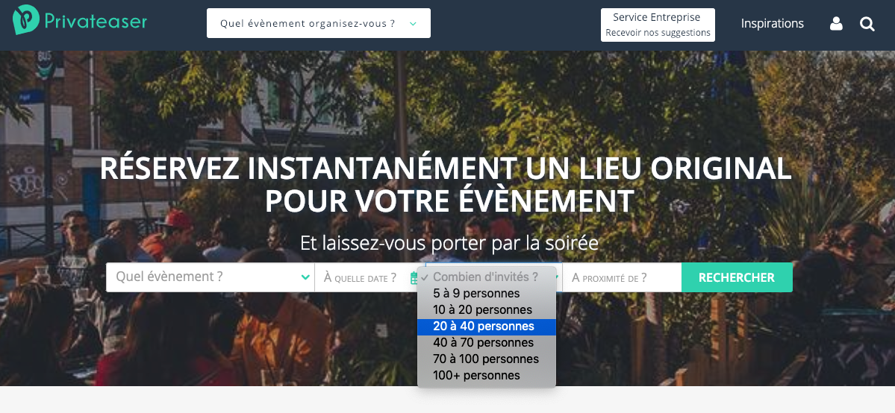
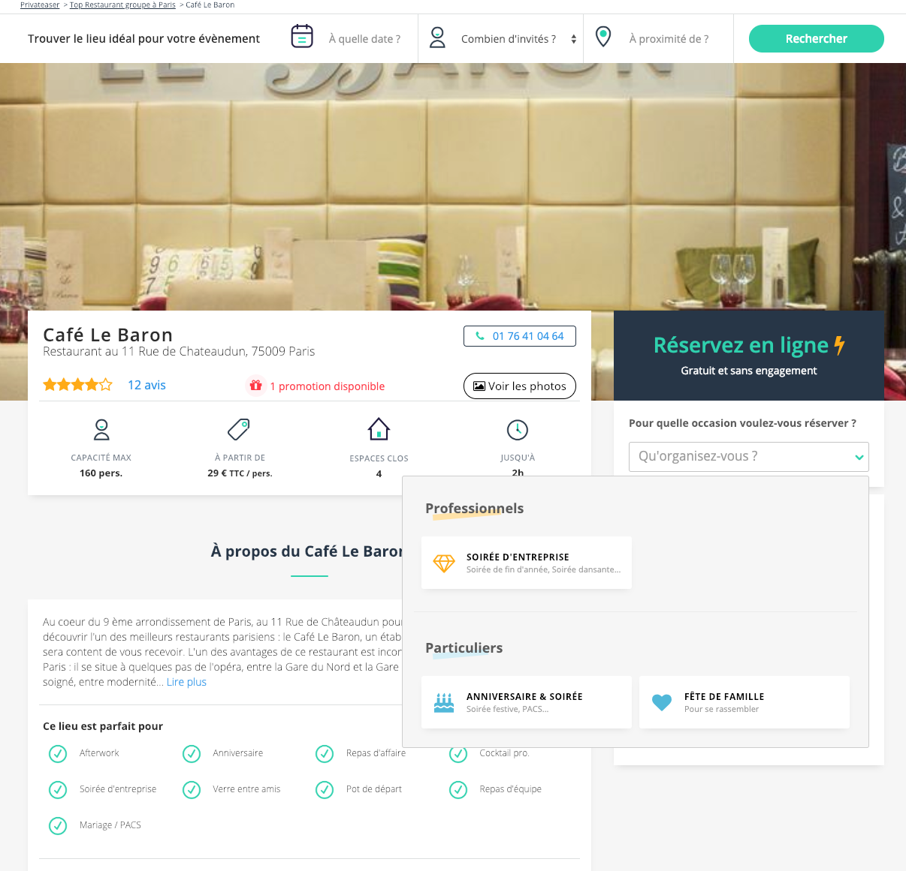

 <!-- .element height="75%" width="75%" -->

---

2018

french startup

---

[privateaser.com](https://www.privateaser.com)

---

wants to digitize the Event management sector

---

🍻 🍽️ 🎉

---

* 100 Billion euros in Europe
* 20 Billion euros in France
* historically complex

---

not much digitized 🖥️

---

you have to pick up your 📱

---

wait to be called back 😴

---

go to visit

---

😓

relou

(_time consuming_)

---

How?

---

by connecting bookers with bars, restaurants and venues in real time

---

13 800 000 💶

---

to find, to compare or to contact a place

---

 <!-- .element height="75%" width="75%" -->

---

to book with an one-click a place for an event

---

 <!-- .element height="75%" width="75%" -->

---

to manage all their events expenses

---

to maximize the occupancy rate and therefore the 💰 of their business

---

🎯 Focus on the price marketplace feature

---

1. the booking price of the `booker`
2. the profit of the `bar`
3. the profit of `privateaser`

---

5 steps

---

## [92bondstreet/privateaser](https://github.com/92bondstreet/privateaser)

---

⌚ Euro-People

### Step 1

---

Booking price

### booking price = time + people

---

🍺 Send more, pay less

### Step 2

---

Decreasing pricing

* 10% after 10 persons
* 30% after 20 persons
* 50% after 60 persons

---

💰 Give me all your money

### Step 3

---

Commission

* 30% of the booking price

---

* insurance → half of commission

---

* the Treasury → 1€ by person

---

* Privateaser → the rest

---

💸 The famous deductible

### Step 4

---

The deductible

1€/person

---

💳 Pay the actors

### Step 5

---

the booker, the bar

---

the insurance, the Treasury and Privateaser

---

👩‍💻 Just tell me what to do

---

* Fork the project via `github`

---

* Clone the project

---

* Open index.html in your browser

---

* Check the ouput in your browser console

---

*  Solve each steps inside `index.js` file with JavaScript

---

* Once the step is solved, commit

---

* 5 steps... 5 commits

---

* Don't forget to push before the end of the workshop
